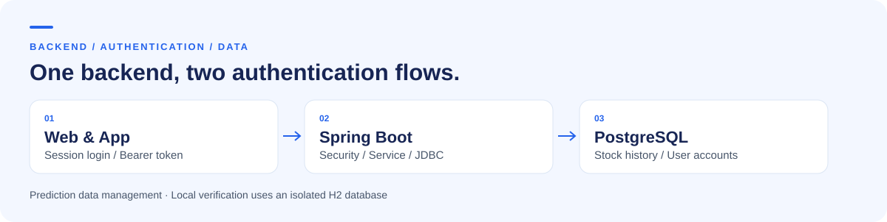
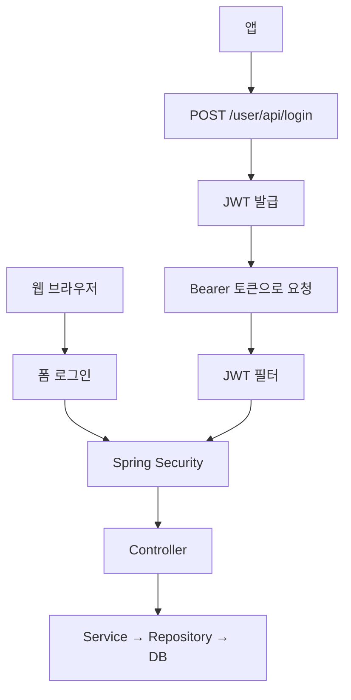

# AiStock Backend

**웹·앱 인증과 주가 예측 데이터의 저장·검색·이력을 관리하는 Spring Boot 백엔드**

**2인 팀 프로젝트** · 조동휘: 백엔드·아키텍처 · 팀원: DB·AI

[핵심 구현](#핵심-구현) · [API](docs/API.md) · [로컬 실행](docs/SETUP.md) · [검증 기록](docs/VALIDATION.md)

## 프로젝트 개요

AI가 만든 예측 가격을 현재 가격과 함께 저장하고, 종목·날짜·활성 상태별로 조회합니다. 브라우저에서는 세션 로그인으로 관리 화면을 사용하고, 앱에서는 JWT를 발급받아 API를 호출하는 흐름을 구현했습니다.

이 저장소의 범위는 **예측 결과를 다루는 백엔드**입니다. AI 모델 개발과 DB 설계·구축은 팀원이 담당했습니다.

| 기능 | 구현 내용 |
| :--- | :--- |
| 웹·앱 인증 | 폼 로그인, BCrypt 비밀번호 해싱, JWT 발급·검증 |
| 예측 결과 저장 | `예측 가격 - 현재 가격`으로 Gap 계산, 같은 종목·날짜의 이력 구분 |
| 조건 검색 | 티커 일치, 종목명 부분 일치, 날짜, `useYN` 조건 조합 |

## 담당 역할

| 담당 | 범위 |
| :--- | :--- |
| **조동휘** | 백엔드 구현, 시스템 아키텍처 설계, 인증과 데이터 처리 흐름 구성 |
| 팀원 | 데이터베이스 설계·구축, AI 모델 개발 |

## 핵심 구현

### 01. 웹 세션과 JWT 인증 연결

브라우저의 폼 로그인과 앱의 토큰 인증을 하나의 Spring Security 설정에서 처리합니다. JWT 필터는 토큰을 검증한 뒤 인증 정보를 설정하고, 주식 화면과 API는 인증된 요청에만 열립니다.

[보안 설정](src/main/java/Nemsi/AiStock/config/SecurityConfig.java) · [JWT 필터](src/main/java/Nemsi/AiStock/config/JwtAuthenticationFilter.java) · [로그인 API](src/main/java/Nemsi/AiStock/controller/UserApiController.java)

현재는 세션과 JWT를 함께 사용하는 구성입니다. API 전용 무상태 필터 체인을 별도로 분리하지는 않았습니다.

### 02. 예측 결과의 이력과 활성 상태 관리

같은 종목·날짜의 예측 데이터가 다시 들어오면 이전 레코드를 `useYN=N`으로 변경하고 새 레코드를 `Y`로 저장합니다. `(ticker, date, id)`로 이력을 구분합니다.

| 예시 | 저장 전 | 새 데이터 저장 후 |
| :--- | :--- | :--- |
| 같은 종목·날짜의 기존 레코드 | `id=0, useYN=Y` | `id=0, useYN=N` |
| 새 레코드 | 없음 | `id=1, useYN=Y` |

Gap은 **가격 차이**이며, 수익률이나 괴리율(%)이 아닙니다. 예를 들어 현재가 150, 예측가 160이면 Gap은 10입니다.

[계산 로직](src/main/java/Nemsi/AiStock/service/PreStockService.java) · [이력 저장 로직](src/main/java/Nemsi/AiStock/respository/JdbcPreStockRepository.java)

### 03. 입력된 조건만 사용하는 검색

검색 조건이 있을 때만 SQL 조건과 바인딩 값을 추가합니다. 티커·날짜·활성 상태는 일치 조건, 종목명은 부분 일치 조건으로 조회합니다.

[검색 API](src/main/java/Nemsi/AiStock/controller/StockApiController.java) · [검색 테스트](src/test/java/Nemsi/AiStock/controller/StockApiControllerTest.java)

## 검증과 실행

저장소에는 도메인·서비스·저장소·컨트롤러 테스트가 있습니다. **테스트 코드의 존재와 통과 여부는 구분**하며, 실제 실행 결과와 제약은 [검증 기록](docs/VALIDATION.md)에 남깁니다.

- [로컬 실행 안내](docs/SETUP.md): JDK·Gradle 준비, 원격 DB를 사용하지 않는 H2 실행 절차
- [API 안내](docs/API.md): 인증, 검색 조건, 응답 예시
- [DB 스키마](src/main/resources/schema.sql): 현재 구현의 테이블 정의

## 현재 한계와 다음 개선

- 같은 종목·날짜에 대한 동시 저장의 트랜잭션·ID 충돌 처리를 보강할 필요가 있습니다.
- 로그인 실패와 잘못된 날짜 입력에 대한 일관된 오류 응답을 정리할 예정입니다.
- 인증 방식별 보안 설정 분리와 인증 실패 시나리오 검증이 필요합니다.
- 실행 설정과 인증 비밀값을 외부 설정으로 분리하고, 개발·테스트 환경을 분리할 필요가 있습니다.

기술 구성과 코드 탐색

| 영역 | 사용 기술 |
| :--- | :--- |
| 서버 | Java 17, Spring Boot 3.4.1 |
| 인증 | Spring Security, JJWT 0.11.5, BCrypt |
| 저장소 | Spring JDBC, PostgreSQL, H2 |
| 화면 | Thymeleaf, Bootstrap |
| 테스트 | JUnit 5, Spring Boot Test, MockMvc |

`config`는 인증과 의존성 구성, `controller`는 웹·API 진입점, `service`는 비즈니스 처리, `respository`는 데이터 접근을 담당합니다. `respository`는 현재 저장소의 실제 디렉터리 이름입니다.

